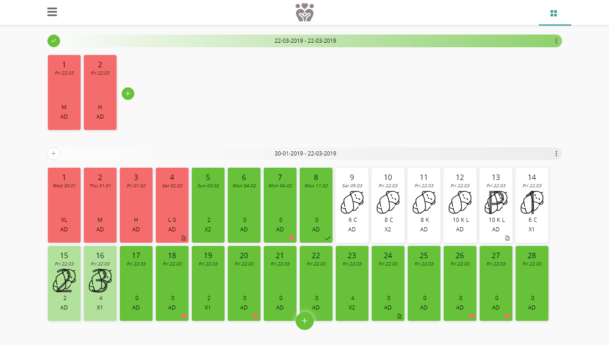
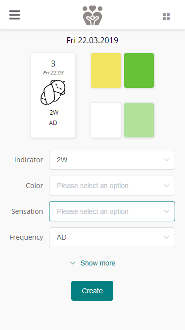
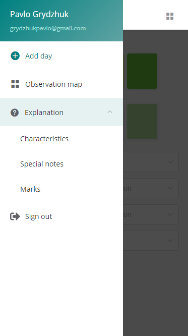

<div style="text-align: center">
  
</div>

# NFP. Natural family planning &middot; [](https://travis-ci.org/npm/npm) [](https://www.npmjs.com/package/npm) [](http://makeapullrequest.com) [](https://github.com/your/your-project/blob/master/LICENSE)

This application is intended to make easier the process of monitoring the biological markers, so that the map for records is always at your fingertips. Suitable for those who are using Creighton Model FertilityCare System (Creighton Model, FertilityCare, CrMS).

Notice. App has only a brief documentation so you have to use Creighton Model before or make monitoring with your instructor.

## Features

* Free and unlimited usage.
* Optimized for modile devices, and can be added to the home screen as a regular app.
* Easy to use interface.
* Ability to add and update all information in any time.

<div style="display: flex; align-items: center; justify-content: center; flex-wrap: wrap">
  
  
  
</div>

## Installing / Getting started

```shell
git clone https://github.com/mazdok/NFP-tracking.git
cd NFP-tracking
npm install
npm run serve 
```
build project

```shell
npm run build
```

## Developing

### Built With

Vue.js, vue-router, vuex, element-ui, firebase

## Database

Data storage - Google Firestore. 